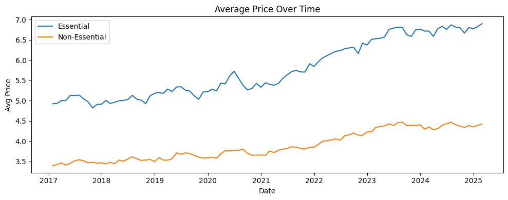
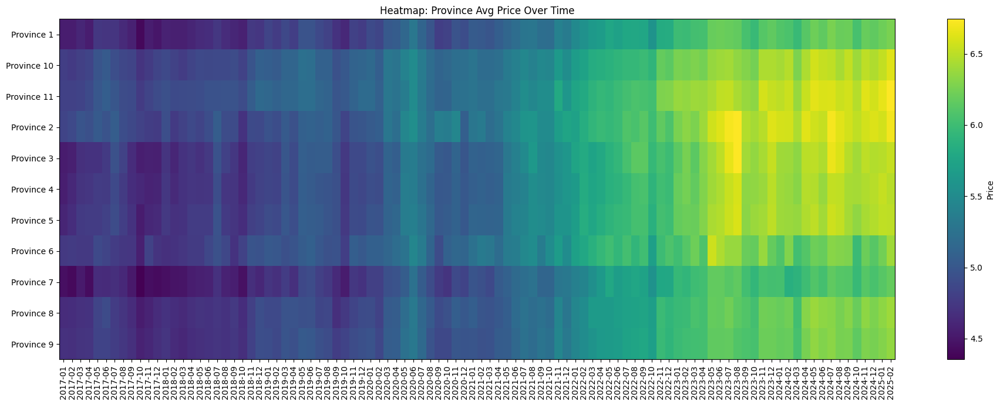
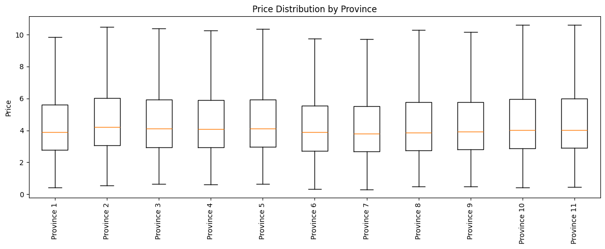
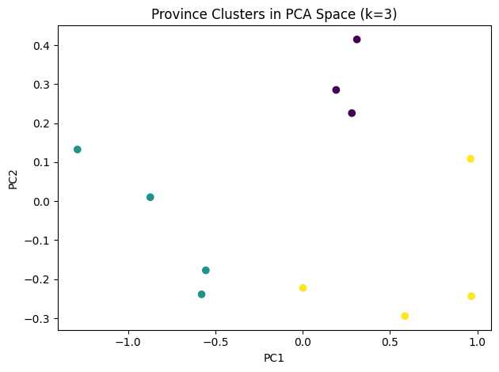
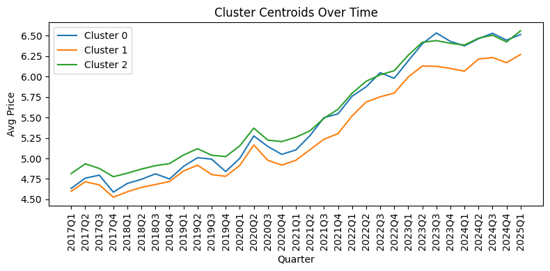
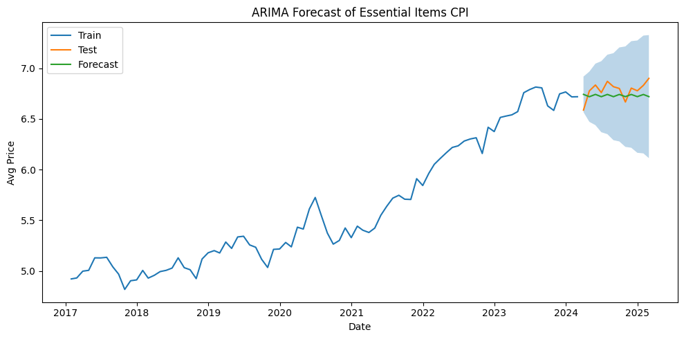

# Regional Dynamics of Canadian Retail Prices

**Exploratory Analysis, Provincial Clustering, and ARIMA-Based Forecasting**

This project analyzes monthly Canadian retail-price data from **2017 to 2025** to understand how prices evolve over time, how they differ across provinces and product types, whether provincial price differences are statistically significant, and whether short-term essential-item prices can be forecast accurately.

The workflow combines **exploratory data analysis (EDA)**, **one-way ANOVA**, **K-Means clustering**, **Principal Component Analysis (PCA)**, and **ARIMA time-series forecasting**.

---

## Project Objectives

The analysis focuses on four main questions:

1. How have **essential** and **non-essential** retail prices changed over time?
2. Do average retail prices differ significantly across provinces?
3. Can provinces be grouped according to similar price patterns?
4. How accurately can an ARIMA model forecast near-term essential-item prices?

---

## Dataset and Preprocessing

The dataset contains retail prices for product categories across **11 provinces** over the 2017–2025 period.

The preprocessing pipeline in the notebook:

- combines `Year` and `Month` into a monthly `date` variable;
- normalizes province values from the `GEO` field;
- converts the `VALUE` column to numeric `Price` values;
- checks for missing and duplicate observations;
- derives quarterly and calendar features for analysis;
- creates monthly and quarterly aggregates for visualization, clustering, and forecasting.

The validation step found **0 missing values** and **0 duplicate rows** after preprocessing.

---

## Analysis Workflow

### 1. Essential vs. Non-Essential Price Trends

Monthly average prices were calculated separately for essential and non-essential products.

<p align="center">
  
</p>

The analysis shows a clear long-term increase in both categories. Essential-product prices are consistently higher and show larger short-term fluctuations, while non-essential prices follow a smoother upward path.

---

### 2. Provincial Price Evolution

A province-by-month heatmap was used to compare how average prices changed geographically over time.

<p align="center">
  
</p>

The heatmap highlights persistent provincial differences while also showing the broad upward price movement after 2021–2022.

---

### 3. Price Distribution by Province

Box plots were used to compare the median, spread, and overall distribution of prices across provinces.

<p align="center">
  
</p>

Although provincial distributions overlap, their centers and spreads are not identical, motivating a formal statistical test.

---

## Statistical Test: One-Way ANOVA

A one-way ANOVA was performed with province as the grouping variable and retail price as the response.

| Metric | Result |
|---|---:|
| F-statistic | **6.31** |
| p-value | **< 0.0001** |

Because the p-value is far below 0.05, the analysis rejects the null hypothesis that all provincial mean prices are equal. This indicates that **province is associated with statistically significant differences in average retail prices** in this dataset.

---

## Provincial Clustering

### K-Means Clustering

Quarterly average prices for each province were used as features for K-Means clustering. Elbow and silhouette diagnostics were examined, and **k = 3** was selected as an interpretable clustering solution.

### PCA Visualization

PCA was used to project the high-dimensional quarterly price profiles into two dimensions for visualization.

<p align="center">
  
</p>

The PCA plot shows visible separation among the three groups, supporting the use of three provincial price-pattern clusters.

### Cluster Assignments

| Province | Cluster |
|---|---:|
| Province 1 | 1 |
| Province 2 | 2 |
| Province 3 | 0 |
| Province 4 | 0 |
| Province 5 | 0 |
| Province 6 | 2 |
| Province 7 | 1 |
| Province 8 | 1 |
| Province 9 | 1 |
| Province 10 | 2 |
| Province 11 | 2 |

### Cluster Price Paths

The quarterly centroid of each cluster shows how its average price pattern evolves over time.

<p align="center">
  
</p>

In this clustering solution:

- **Cluster 1** contains the lowest-price group;
- **Cluster 0** represents a middle-price group;
- **Cluster 2** contains the highest-price group.

All three clusters show a similar broad inflationary pattern after 2021, while differences between the groups remain visible.

---

## ARIMA Time-Series Forecasting

Essential-item monthly average prices were modeled using an **ARIMA(1, 1, 1)** model. The final 12 observations were held out as a test set, and the model generated a 12-step forecast with confidence intervals.

<p align="center">
  
</p>

### Forecast Performance

| Metric | Score |
|---|---:|
| RMSE | **0.10** |
| MAE | **0.09** |
| MAPE | **1.32%** |

The forecast follows the held-out observations closely, with a mean absolute percentage error below 2% for the evaluated period.

---

## Key Findings

- Canadian retail prices in the dataset generally increased between **2017 and 2025**.
- Essential items show stronger short-term fluctuations than non-essential items.
- Provincial average prices are statistically different according to the ANOVA result (**F = 6.31, p < 0.0001**).
- K-Means clustering identifies **three distinct provincial price-pattern groups**.
- The three clusters preserve relative price differences even while following a common upward trend.
- The **ARIMA(1,1,1)** model achieved **RMSE = 0.10**, **MAE = 0.09**, and **MAPE = 1.32%** on the 12-month holdout period.

---

## Technologies Used

- **Python**
- **Pandas** — data loading, cleaning, aggregation, and transformation
- **NumPy** — numerical operations
- **Matplotlib** — visualizations
- **SciPy** — one-way ANOVA
- **Scikit-learn** — K-Means, PCA, silhouette analysis, and error metrics
- **Statsmodels** — ARIMA time-series forecasting
- **Jupyter Notebook** — interactive analysis

---

## Repository Structure

```text
.
├── Retail_Prices_Final_Project.ipynb
├── Retail_Prices_of _Products.csv
├── README.md
└── figures/
    ├── average-price-trends.png
    ├── province-price-heatmap.png
    ├── province-price-distributions.png
    ├── province-clusters-pca.png
    ├── cluster-centroids.png
    └── arima-forecast.png
```

> If your notebook or dataset uses a slightly different filename in the repository, update the structure above and the CSV path in the notebook accordingly.

---

## How to Run the Project

### 1. Clone the repository

```bash
git clone <your-repository-url>
cd <repository-folder>
```

### 2. Install the required Python packages

```bash
pip install pandas numpy matplotlib scipy scikit-learn statsmodels jupyter
```

### 3. Start Jupyter Notebook

```bash
jupyter notebook
```

Open `Retail_Prices_Final_Project.ipynb` and run the cells from top to bottom. Make sure `Retail_Prices_of _Products.csv` is in the project directory or update `file_path` in the notebook.

---

## Possible Future Improvements

The project can be extended by:

- adding external explanatory variables such as fuel prices or exchange rates;
- testing seasonal ARIMA/SARIMA specifications;
- building product-level or category-level forecasting models;
- analyzing socioeconomic variables that may explain persistent provincial price differences;
- comparing ARIMA with machine-learning or deep-learning forecasting methods.

---

## Author

**Akbar Hasanzade**  
Computer Engineering, Bahcesehir University